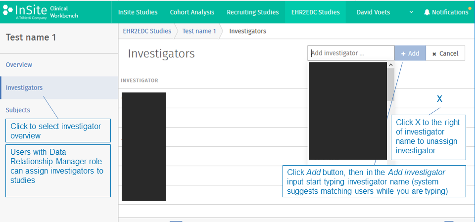
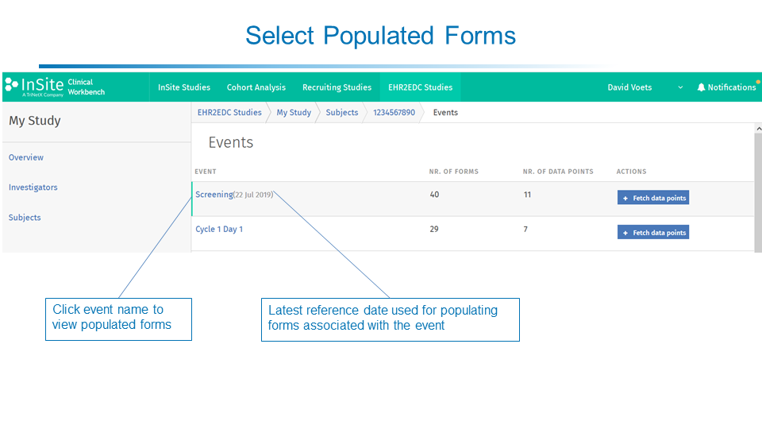

# EHR2EDC
_From Electronic Health Records to Electronic Data Capture systems_

This application facilitates user-assisted automated pre-filling of eCRFs in an EDC system with clinical patient data originating from an EHR system or clinical data warehouse, thus avoiding manual error-prone re-entry.
Patient records can either be read from an [i2b2](https://www.i2b2.org/) data warehouse schema or via the [FHIR](https://hl7.org/FHIR/) interface of an EHR. You are welcome to write your own connectors to read from (or write to) other data sources.
The EHR2EDC app requires a [PostgreSQL](https://www.postgresql.org/) database (for storing users, their roles and credentials) and a [mongoDB](https://www.mongodb.com/) database (for storing studies). The [PostgreSQL](https://www.postgresql.org/) database is versioned using [Flyway (TM)](https://flywaydb.org/).
The EHR2EDC module has connectors for and has been tested with the [Medidata Rave (TM)](https://www.medidata.com/en/products/edc/) and [OpenClinica (TM)](https://www.openclinica.com/) Electronic Data Capture (EDC) systems.

A large part of this code base was developed to support the pilot activities of the [EIT Health](https://eithealth.eu/) [EHR2EDC](https://eithealth.eu/project/ehr2edc/) project. 
More information can be found [here](https://eithealth.eu/project/ehr2edc/).

Another large part of this code base was developed for the [InSite platform](https://www.insiteplatform.com). 

## License
See [license.txt](license.txt)

## Prerequisites
The relevant clinical observations made before, during or after a subject visit or the relevant clinical observations for an unscheduled event are to be recorded in a structured way (not free-text) in one or more of the EHR data sources that are integrated in your data warehouse or accessed through FHIR. 
The time between making a relevant clinical observation and the availability of the corresponding structured clinical observation record in the EHR data sources must be less than the expected EDC data entry timeline as communicated by the sponsor of the study for which you use these capabilities.
There must be no technical constraints that prohibit the EHR data sources update daily (full or incremental).
The software must be allowed to connect to the EDC system that is used by the sponsor for data entry for a given study for which you use this software. This may require adapting local firewall rules.

## Architecture
This application can be considered a _modular monolith_ adopting many concepts of the [_Clean Architecture_](https://blog.cleancoder.com/uncle-bob/2012/08/13/the-clean-architecture.html) and relying on some [DDD](https://en.wikipedia.org/wiki/Domain-driven_design) concepts like domain vocabulary and domain events. 
The EHR2EDC capabilities were implemented as new modules on an existing application (the InSite Clinical Workbench, referred to in this code base as local workbench).

The application contains the following maven modules:
* ehr2edc: core of the ehr2edc application
* infrastructure: cross-cutting application concerns 
* local-workbench: generic application concerns, e.g. login, user management
* local-workbench-ehr2edc: api between ehr2edc module and local workbench module: for listing users and for retrieving the current user
* local-workbench-main: Spring boot application for running local workbench on tomcat
* local-workbench-war: packaging as a war (web archive)
* local-workbench-web: web application resources
* local-workbench-zip: deployment artifacts

## Building the application

You'll need [Maven](https://maven.apache.org/). Run `mvn package` to produce a deployable war.

## Deploying the application

### Application database
This application relies on PostgreSQL for managing users and their credentials.
You can point the web application to your postgres database using the following VM properties:

| VM property       | Example                         |
|-------------------|---------------------------------|
| database.url      | jdbc:postgresql://localhost/lwb |
| database.username | lwb_user                        |
| database.password | password                        |

If you start with an empty database, you can enable flyway migrations to have the tables and their initial content generated:

| VM property           | Value |
|-----------------------|-------|
| spring.flyway.enabled | true  |


### EHR2EDC data mart
Make sure you have a mongoDB running. You can configure the connection with the following VM properties: 

| VM property                                     | Example   |
|-------------------------------------------------|-----------|
| ehr2edc.db.mongodbquery.host                    | localhost |
| ehr2edc.db.mongodbquery.port                    | 27017     |
| ehr2edc.db.mongodbquery.database                | insite    |
| ehr2edc.db.mongodbquery.username                | insite    |
| ehr2edc.db.mongodbquery.password                | password  |
| ehr2edc.db.mongodbquery.authentication-database | admin     |

To authenticate as a user, you must provide a username, password, and the authentication database associated with that user.

Enable mongo transactions by setting the following vm property:

| VM property                | Value |
|----------------------------|-------|
| ehr2edc.mongo.transactions | true  |

EHR2EDC uses Spring Data MongoDB, and is configured to connect to a local Mongo in a Docker container when running locally.
Local configuration can be found at `ehr2edc-infra-mongo-query.properties`. 

Following commands help you setup the local container, and accessing the database through the Mongo Shell. The `insite` database is populated by the `mongo-migrator` project. 
* Start a local mongo container  
```
docker run -d -p 27017-27019:27017-27019 \
    -e MONGO_INITDB_ROOT_USERNAME=insite \
    -e MONGO_INITDB_ROOT_PASSWORD=password \
    --name ehr2edc-mongo \
    mongo:3.6.12
```
* Open local mongo shell  
```
docker exec -it ehr2edc-mongo \
    mongo -u insite -p password --authenticationDatabase admin
```

Use the following command to start a mongo shell and create a replicaset on your local mongo instance:

```
docker exec ehr2edc-mongo  mongo -u insite -p password --authenticationDatabase admin --eval "rs.initiate({_id : \"insite-mongo-set\", members: [{_id : 0, host : \"localhost:27017\"}]})"
```

It should print something like this: `{ "ok" : 1 }`


### Web application container
Deploy the war on [Apache Tomcat](http://tomcat.apache.org/). 

Your environment should be runnable immediately if you start tomcat with these options:

`-Dspring.profiles.active=FLYWAY_MIGRATE -Dlogging.level.org.hibernate=error -Dsynchronize.studies=false -Ddatabase.url=jdbc:postgresql://localhost/lwb -D -Dspring.flyway.enabled=true -Ddatabase.username=lwb_user -Ddatabase.password=lwb_user -Ddatabase.url=jdbc:postgresql://localhost:5432/lwb -Dspring.jmx.enabled=false -Dehr2edc.mongo.transactions=true -Dehr2edc.api.admin.credentials.username=test -Dehr2edc.api.admin.credentials.password=test -Ddatawarehouse.datasource.url=jdbc:postgresql://localhost:5432/i2b2demodata -Ddatawarehouse.datasource.username=user -Ddatawarehouse.datasource.password=pass`                                                                                                                                                                                                                                                                                                                                                                                                                               

## Using the application

### Creating a study
You create a study by importing a valid [ODM](https://www.cdisc.org/standards/data-exchange/odm) v1.3.2 file.
This is done by `POST`ing it as a multipart file to the `/ehr2edc/studies` endpoint, like so:

`curl -X POST $HOST/ehr2edc/studies -F file=/path/to/my/odm.xml`

Next, you'll want to add mappings to the study to enable prefilling the study's eCRFs with ehr data.
Adding a mapping for a given item (identified by odm ItemDef OID) is done with the following REST call:

`curl -X POST "$HOST"/ehr2edc/studies/"$STUDY_ID"/item-query-mappings -H "Content-Type: application/json" -d "/path/to/my/mapping.json"`

For example, the json to map a patient's birth date to the `I_DEMOG_AGE` item in an eCRF containing the subject's current age, could look as follows:
```
{
  "itemId": "I_DEMOG_AGE",
  "query": {
    "type": "demographic",
    "criteria": {
      "criteria": [
        {
          "type": "demographicType",
          "demographicType": "BIRTH_DATE"
        }
      ]
    }
  },
  "projectors": [
    {
      "type": "dateOfBirth"
    },
    {
      "type": "dateOfBirthToAge",
      "unit": "YEARS"
    },
    {
      "type": "ageToNumerical"
    }
  ]
}

```

### Connecting to an EHR data source
You can connect to an EHR data source by executing the following mongo update:
```
document=$(cat /path/to/link-ehr.json)
mongo -u $MONGO_USER -p $MONGO_PASSWORD --authenticationDatabase "${AUTH_SOURCE}" --eval "db.getCollection(\"EHRConnection\").remove({ \"studyId\": \"${EFFECTIVE_STUDY_ID}\"});" $DATABASE
mongo -u $MONGO_USER -p $MONGO_PASSWORD --authenticationDatabase "${AUTH_SOURCE}" --eval "db.getCollection(\"EHRConnection\").insert($document);" $DATABASE

```

where `link-ehr.json` looks something like:

```
{
  "_id": "___EFFECTIVE_STUDY_ID___",
  "uri": "http://hapi.fhir.org/baseDstu2",
  "system": "FHIR"
}
```

The `system` property value is either `MONGO` (legacy mongo model as populated from i2b2 by the mongo-migrator module) or `FHIR` (FHIR SDTU2-compliant EHR)

If you are using a `MONGO` EHR connection, you can populate it from an i2b2 data warehouse by running the following command against your running application:
```
curl -u test:test -X POST http://localhost:8080/ehr2edc/datawarehouse
```
In the above command you have to pass the api administrative username and password to authorize the operation. 
These correspond to the values of the `ehr2edc.api.admin.credentials.username` and `ehr2edc.api.admin.credentials.password` configuration properties.
This will start the export of patientIds in the i2b2 database to the mongo db.

The following configuration properties can be used to customize your i2b2 database connection settings:

| Configuration property                     | Example                                       |
|--------------------------------------------|-----------------------------------------------|
| datawarehouse.datasource.url               | jdbc:postgresql://localhost:5432/i2b2demodata |
| datawarehouse.datasource.username          | user                                          |
| datawarehouse.datasource.password          | password                                      |
| datawarehouse.datasource.driver-class-name | org.postgresql.Driver                         |

### Connecting to an EDC
You can connect to an EDC system for reading subjects, writing eCRFs or for creating subjects by executing the following REST API call:
`curl -X POST $HOST/ehr2edc/edc/connection -d /path/to/my/link-edc.json -H "Content-Type: application/json"`

For connecting to Medidata Rave (TM) set the `edcSystem` json property to `RAVE`. For OpenClinica (TM) set it to `OPEN_CLINICA`.
The connection `type` values for reading, writing or creating are `READ_SUBJECTS`, `SUBMIT_EVENT`, `WRITE_SUBJECT` respectively.

For example, the json file for connecting to a study on Rave for reading subjects could look as follows:
```
{
   "studyId": "RAVE_STUDY_ID",
   "type": "READ_SUBJECTS",
   "edcSystem": "RAVE",
   "externalSiteId": "MY_RAVE_SITE_ID",
   "clinicalDataURI": "https://innovate.mdsol.com/RaveWebServices/studies/Mediflex(Dev)/Subjects",
   "username": "me",
   "password": "$3cReT",
   "enabled": true
 }
```

### Using the study

#### Make sure you have an account
After you have started the web application, when you point your browser to it, you will get redirected to the login page.


Click the _request account_ link to create a new account.


After completing this form, when you log in as an administrator and head for the user listing screen, 


you should see the newly requested account.


Clicking the _pending_ state next to the new account, and then clicking the _accept_ button, will activate the account.


After activating the account, the user will be listed as _active_. The administrator can also assign roles to the account.
To list and access all defined studies, you'll need the _Data Relationship Manager_ (DRM) role.

As an administrator, you can also create the account yourself by clicking the _invite a new user_ button. The user will receive an email to choose a password and activate their account.

When accessing the application as a DRM (or as a user assigned to a given study), you will see all defined studies listed on the main page (or only the studies to which you have been assigned if you are not a DRM).


Click a study name to select it.

The left menu allows going to the list of members assigned to the study team (investigators).



The left menu allows going to the list of subjects (patients) enrolled in the study


Clicking a subject takes you to the overview of study events. Events represent a collection of forms to be collected at scheduled or unscheduled points in time during the subject's participation in the study:


From this view you can select an event for which forms are to be prefilled with EHR data:


The result looks like this:


Prefilled forms are accessible from a subject overview by clicking the name of the event of interest.



You can then review the form data that was prefilled based on the selected time point:


You can access the complete history of prefilled forms


Similarly you can access the complete history of prefilled form submissions to the EDC


## Contact

If you have questions, please reach us at info@custodix.com.